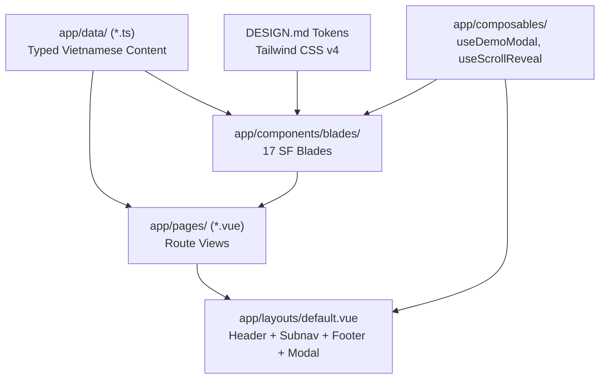

# Architecture Spine: bidly CRM

Bản kiến trúc cốt lõi (Architecture Spine) xác lập các quy tắc bất biến, cấu trúc phân lớp mô-đun và hợp đồng dữ liệu cho website CRM trên nền tảng **Nuxt 4 + Vue 3**, mô phỏng giao diện [Salesforce CRM](https://www.salesforce.com/ap/crm/) với toàn bộ nội dung được bản địa hóa sang **Tiếng Việt**.

---

## 1. Mô hình Thiết kế & Hệ thống (Design Paradigm)

- **Paradigm**: Component-Driven Modular Web Application (SSG/SSR Hybrid với Nuxt 4 & Vue 3).
- **Nguyên tắc cốt lõi (Core Principles)**:
  1. **Separation of Concerns (SoC)**: Tách biệt hoàn toàn giữa Template hiển thị (Vue Components) và Dữ liệu nội dung (Typed Data Layer).
  2. **Atomic Blade Architecture**: Mỗi Blade trong 17 Blades của Salesforce CRM là một component độc lập, tự đóng gói styling và tương tác.
  3. **Performance First**: Sử dụng Tailwind CSS v4 kết hợp CSS Custom Properties, tối ưu font `Salesforce Sans`, ảnh WebP và lazy-load các thành phần nặng.

---

## 2. Các Quyết định Kiến trúc Bất biến (Architectural Decisions)

### `[AD-1]` Nền tảng & Framework [ADOPTED]
- **Binds**: Toàn bộ dự án.
- **Prevents**: Phân mảnh công nghệ, dùng sai phiên bản Vue hoặc cấu hình SSR không đồng nhất.
- **Rule**: Sử dụng **Nuxt 4 (`^4.5.x`)** với **Vue 3 (`^3.5.x`)**, triển khai cấu trúc thư mục mới của Nuxt 4 (`app/pages`, `app/components`, `app/layouts`, `app/data`, `app/assets`). Tất cả component viết bằng `<script setup lang="ts">`.

### `[AD-2]` Cấu trúc Phân rã Component (Component Taxonomy)
- **Binds**: `app/components/` & `app/layouts/`.
- **Prevents**: Trộn lẫn giữa UI Atom và Business Blade, component phình to khó tái sử dụng.
- **Rule**:
  - `app/layouts/default.vue`: Chứa Global Nav tầng 1, ContextNav C360 tầng 2, Footer và Global Modals.
  - `app/components/blades/`: Chứa 17 Blade components chuyên biệt (`SfHeroMarquee.vue`, `SfResourceGrid.vue`, `SfFeatureZPattern.vue`, `SfProductTabs.vue`, `SfLogoGrid.vue`, `SfContactPillars.vue`, `SfFaqAccordion.vue`,...).
  - `app/components/ui/`: Chứa các phần tử cơ sở (`SfButton.vue`, `SfBadge.vue`, `SfModal.vue`, `SfCard.vue`).

### `[AD-3]` Chiến lược Styling & Design Tokens (Tailwind CSS Integration)
- **Binds**: Toàn bộ UI layer.
- **Prevents**: Viết CSS tùy tiện, sai lệch mã màu thương hiệu `#0176D3` và `#032D60`.
- **Rule**: Sử dụng **Tailwind CSS v4** kết hợp theme tokens tùy biến ánh xạ trực tiếp từ `DESIGN.md`:
  - `colors.brand.primary`: `#0176D3`
  - `colors.brand.navy`: `#032D60`
  - `colors.brand.hover`: `#014486`
  - `colors.surface.light`: `#F4F6F9`
  - Typography scale và Keyframes animation (`animate-float`, `animate-fade-in-up`).

### `[AD-4]` Quản lý Dữ liệu Nội dung (Typed Content Layer)
- **Binds**: `app/data/`.
- **Prevents**: Hardcode text tĩnh vào HTML template gây khó khăn cho việc chỉnh sửa và dịch thuật.
- **Rule**: Toàn bộ nội dung text tiếng Việt của 17 Blades, menu điều hướng, bảng giá và FAQ được định nghĩa dưới dạng Typed Objects trong `app/data/*.ts` (`navigation.ts`, `crm-blades.ts`, `pricing.ts`, `faqs.ts`).

### `[AD-5]` Quản lý Trạng thái & Tương tác (Composables)
- **Binds**: `app/composables/`.
- **Prevents**: Trạng thái modal/drawer phân tán, rò rỉ bộ nhớ sự kiện cuộn trang.
- **Rule**: Đóng gói các logic dùng chung thành Vue Composables:
  - `useDemoModal.ts`: Quản lý trạng thái mở/đóng hộp thoại video demo.
  - `useScrollReveal.ts`: Kích hoạt hiệu ứng xuất hiện khi cuộn trang bằng Intersection Observer.
  - `useToast.ts`: Hiển thị thông báo phản hồi sau khi gửi form.

### `[AD-6]` Tối ưu Hóa SEO & Metadata
- **Binds**: `app/pages/`.
- **Prevents**: Thiếu thẻ meta SEO hoặc trùng lặp canonical URL.
- **Rule**: Mỗi trang phải khai báo `useSeoMeta()` đầy đủ tiêu đề, mô tả tiếng Việt và Open Graph tags tương ứng.

---

## 3. Sơ đồ Cấu trúc Dự án (Project Directory Tree)

```
bidly/
├── app/
│   ├── assets/
│   │   └── css/
│   │       └── main.css               # Tailwind CSS imports & custom animations
│   ├── components/
│   │   ├── blades/                    # 17 Blades của Salesforce CRM
│   │   │   ├── SfHeroMarquee.vue      # Blade 1: Hero & Demo trigger
│   │   │   ├── SfResourceGrid.vue     # Blade 2 & 15: 3-up Cards
│   │   │   ├── SfHeading.vue          # Blade 3, 7, 9, 12: Section Headings
│   │   │   ├── SfFeatureZPattern.vue  # Blade 4, 5, 6: Z-pattern features
│   │   │   ├── SfProductTabs.vue      # Blade 8, 10, 13, 14: 5 Core Clouds tabs
│   │   │   ├── SfLogoGrid.vue         # Blade 11: Logo khách hàng
│   │   │   ├── SfContactPillars.vue   # Blade 16: 3 cột liên hệ
│   │   │   └── SfFaqAccordion.vue     # Blade 17: FAQ Accordion
│   │   ├── ui/
│   │   │   ├── SfButton.vue           # Primary, Secondary, Pill buttons
│   │   │   ├── SfBadge.vue            # Floating badges / Tags
│   │   │   └── SfDemoModal.vue        # Video / Interactive Demo popup
│   │   ├── AppHeader.vue              # Dual-layer Nav (Global + ContextNav C360)
│   │   └── AppFooter.vue              # Multi-column Footer
│   ├── composables/
│   │   ├── useDemoModal.ts
│   │   └── useScrollReveal.ts
│   ├── data/
│   │   ├── navigation.ts              # Menu links & mega-menu items
│   │   ├── crm-blades.ts              # Nội dung Tiếng Việt cho 17 Blades
│   │   ├── pricing.ts                 # Dữ liệu bảng giá & tính năng
│   │   └── faqs.ts                    # 12 câu hỏi & câu trả lời FAQ
│   ├── layouts/
│   │   └── default.vue                # Khung Layout chuẩn
│   ├── pages/
│   │   ├── index.vue                  # Trang chủ CRM Hub (17 Blades)
│   │   └── crm/
│   │       ├── what-is-crm.vue        # Trang khái niệm CRM
│   │       ├── pricing.vue            # Trang bảng giá
│   │       └── free-trial.vue         # Trang form đăng ký dùng thử 30 ngày
│   └── app.vue                        # Nuxt Root App
├── nuxt.config.ts                     # Cấu hình Nuxt 4, Tailwind & Head
├── package.json
└── tsconfig.json
```

---

## 4. Sơ đồ Luồng Dữ liệu (Data Flow)



---

## 5. Môi trường Thực thi & Vận hành (Operational Envelope)

- **Lệnh phát triển (Dev)**: `npm run dev` (Khởi chạy máy chủ phát triển Nuxt 4).
- **Kiểm tra Typescript (Lint/Typecheck)**: `npx nuxi typecheck`.
- **Đóng gói Bundle (Build)**: `npm run build` (Tạo production bundle tối ưu).

---

## 6. Hạng mục Trì hoãn (Deferred Items)
- **Hệ thống Backend Database**: Giai đoạn này tập trung vào Frontend & Static Lead Form Capture; việc kết nối cơ sở dữ liệu CRM thực tế được chuyển sang giai đoạn phát triển Backend tiếp theo.
